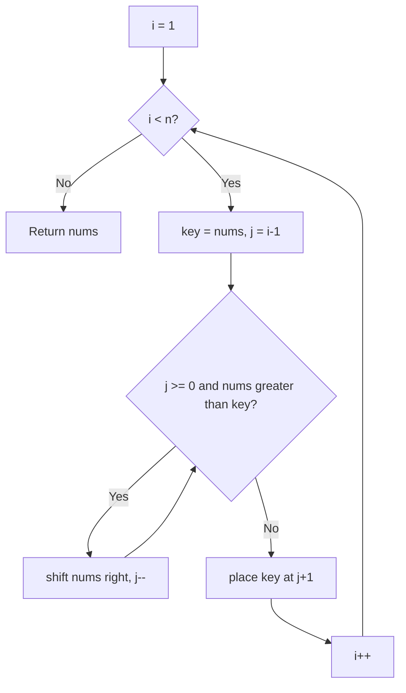

# Sort an Array

**NeetCode:** [Sort an Array](https://neetcode.io/problems/sort-an-array)
**Difficulty:** Medium | **Pattern:** Sorting

---

## Problem

Given an integer array `nums`, sort it in ascending order and return it. The exercise exists to practice implementing sorting algorithms by hand rather than calling a built-in sort.

---

## Solution 1 — Bubble Sort (`solution_bubble_sort.cpp`)

### Approach
Repeatedly scan the array comparing adjacent elements and swapping them if they're out of order. Each full pass "bubbles" the largest remaining value to its correct position at the end of the unsorted range, so the outer boundary shrinks by one every pass.

### Algorithm
1. Let `i` run from `n-1` down to `0` — `i` marks the end of the still-unsorted range.
2. For `j` from `0` to `i-1`, compare `nums[j]` and `nums[j+1]`.
3. If `nums[j] > nums[j+1]`, swap them.
4. After each outer pass, the largest unsorted element has moved into place at index `i`.
5. Return `nums` once `i` reaches 0.

### Complexity

| | Value |
|---|---|
| **Time** | O(n²) worst/average case, O(n²) best case (no early-exit flag) |
| **Space** | O(1) |

### Key Insight
Bubble sort only ever fixes adjacent inversions, so a single out-of-place small value near the end takes many passes to migrate to the front. This implementation has no "swapped this pass?" flag, so it always runs the full n² comparisons even on an already-sorted array.

### Flowchart

```mermaid
flowchart TD
    A[i = n-1] --> B{i >= 0?}
    B -- No --> Z[Return nums]
    B -- Yes --> C[j = 0]
    C --> D{j < i?}
    D -- Yes --> E{nums[j] > nums[j+1]?}
    E -- Yes --> F[swap nums[j], nums[j+1]]
    F --> G[j++]
    E -- No --> G
    G --> D
    D -- No --> H[i--]
    H --> B
```

### Visualization

Sorting `[5, 2, 4, 1, 3]` — orange = comparing, red = swapping, green = locked into final position:


---

## Solution 2 — Selection Sort (`solution_selection_sort.cpp`)

### Approach
For each position `i`, scan the remaining unsorted suffix `[i, n)` to find the minimum value, then swap it into position `i`. This grows a sorted prefix from the front, one confirmed-minimum element at a time.

### Algorithm
1. For `i` from `0` to `n-1`:
2. Scan `j` from `i` to `n-1`, tracking the smallest value seen (`min`) and its index (`min_idx`).
3. Swap `nums[i]` with `nums[min_idx]`.
4. Return `nums` once every position has been filled.

### Complexity

| | Value |
|---|---|
| **Time** | O(n²) — always, regardless of input order |
| **Space** | O(1) |

### Key Insight
Selection sort always does exactly n-1 swaps (one per outer iteration), far fewer than bubble sort's swaps — useful when writes are expensive — but it still scans the full remaining suffix every time, so it can't finish early on sorted input the way insertion sort can.

### Flowchart

```mermaid
flowchart TD
    A[i = 0] --> B{i < n?}
    B -- No --> Z[Return nums]
    B -- Yes --> C[min_idx = i, j = i]
    C --> D{j < n?}
    D -- Yes --> E{nums[j] < nums[min_idx]?}
    E -- Yes --> F[min_idx = j]
    F --> G[j++]
    E -- No --> G
    G --> D
    D -- No --> H[swap nums[i], nums[min_idx]]
    H --> I[i++]
    I --> B
```

### Visualization

Sorting `[5, 2, 4, 1, 3]` — orange = current min candidate being compared, red = final swap into place, green = locked in:


---

## Solution 3 — Insertion Sort (`solution_insertion_sort.cpp`)

### Approach
Grow a sorted prefix on the left. For each new element (`key`), shift every larger element in the sorted prefix one slot to the right, then drop `key` into the gap left behind. Equivalent to how you'd sort playing cards in your hand.

### Algorithm
1. For `i` from `1` to `n-1`, take `key = nums[i]`.
2. Set `j = i - 1`.
3. While `j >= 0` and `nums[j] > key`, shift `nums[j]` into `nums[j+1]` and decrement `j`.
4. Place `key` at `nums[j+1]`.
5. Return `nums` once every index has been inserted.

### Complexity

| | Value |
|---|---|
| **Time** | O(n²) worst/average case, **O(n)** best case (already sorted) |
| **Space** | O(1) |

### Key Insight
Insertion sort is adaptive — the inner `while` loop exits immediately when `key` is already in the right place, so nearly-sorted input runs close to linear time. Of the three approaches here, this is the one worth defaulting to for small or partially-sorted arrays.

### Flowchart



### Visualization

Sorting `[5, 2, 4, 1, 3]` — orange = key just picked up, red = shifting/inserting, green = sorted prefix:


---

## Example Walkthrough (Solution 3 — Insertion Sort)

Input: `nums = [5, 2, 4, 1, 3]`

| i | key | Shifts (j walked back while nums[j] > key) | nums after insertion |
|---|---|---|---|
| 1 | 2 | j=0: `5 > 2` → shift 5 right; j=-1 → stop | `[2, 5, 4, 1, 3]` |
| 2 | 4 | j=1: `5 > 4` → shift 5 right; j=0: `2 > 4`? No → stop | `[2, 4, 5, 1, 3]` |
| 3 | 1 | j=2: `5>1` shift; j=1: `4>1` shift; j=0: `2>1` shift; j=-1 → stop | `[1, 2, 4, 5, 3]` |
| 4 | 3 | j=3: `5>3` shift; j=2: `4>3` shift; j=1: `2>3`? No → stop | `[1, 2, 3, 4, 5]` |

Final result: `[1, 2, 3, 4, 5]` — matches the expected sorted output.

---

## Comparison

| | Bubble Sort | Selection Sort | Insertion Sort |
|---|---|---|---|
| Time (worst) | O(n²) | O(n²) | O(n²) |
| Time (best) | O(n²) | O(n²) | **O(n)** |
| Swaps/writes | Many (every inversion) | Exactly n-1 | Many (shifts), but only when needed |
| Adaptive (fast on sorted input)? | ❌ | ❌ | ✅ |
| Stable? | ✅ | ❌ (swap can reorder equal keys) | ✅ |
| Preferred? | ❌ Weakest — no early exit, high swap count | ⚠️ Predictable but wasteful scans | ✅ Best of the three for small/nearly-sorted arrays |

## Common Mistake
All three are O(n²) algorithms. `Sort an Array` on LeetCode has inputs up to 5×10⁴ elements, so none of these will pass within the time limit at full scale — the intended solution is an O(n log n) approach like merge sort or randomized quicksort. These implementations are valuable for building sorting fundamentals, not for clearing the actual constraints.
