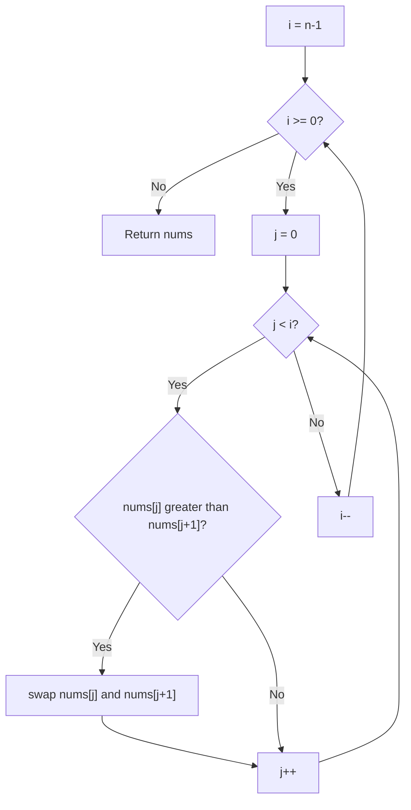
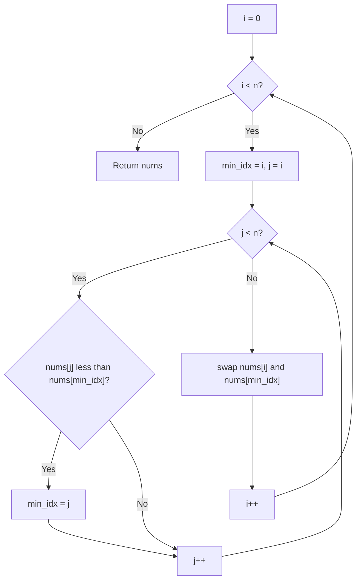
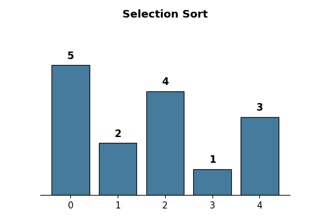
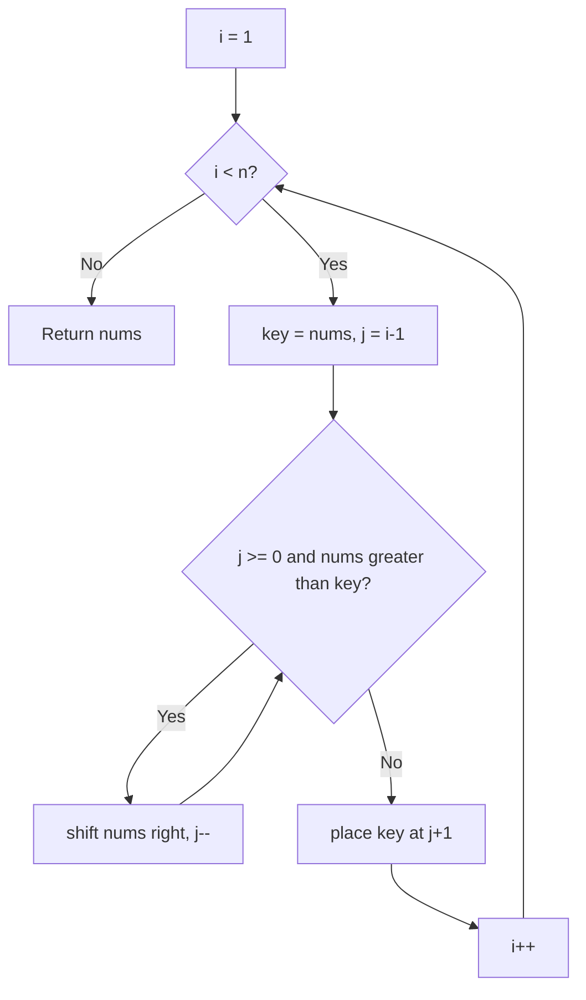
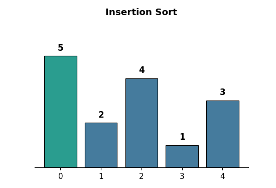
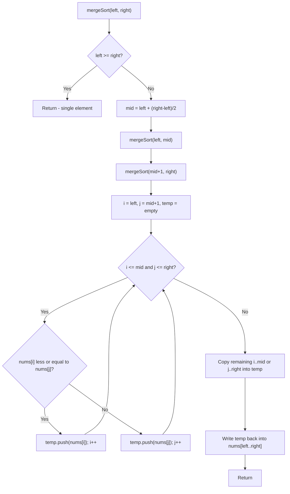
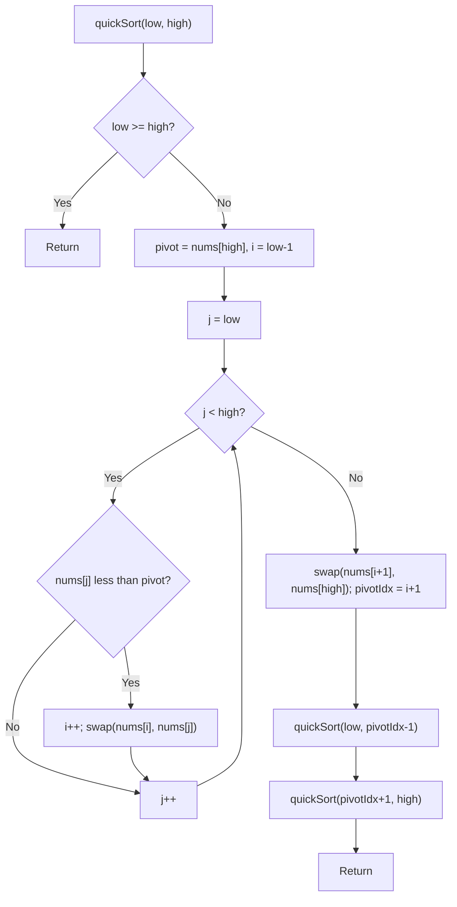
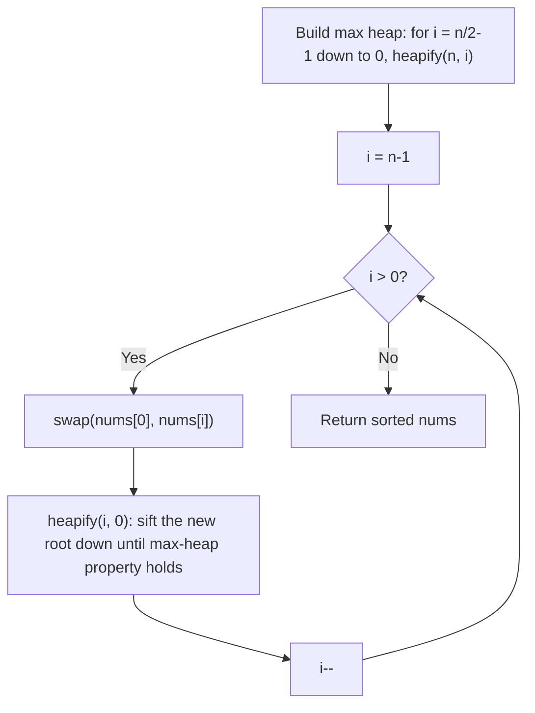

# Sort an Array

**NeetCode:** [Sort an Array](https://neetcode.io/problems/sort-an-array)
**Difficulty:** Medium | **Pattern:** Sorting (O(n²) fundamentals + O(n log n) interview staples)

---

## Problem

Given an integer array `nums`, sort it in ascending order and return it. The exercise exists to practice implementing sorting algorithms by hand rather than calling a built-in sort.

---

## Solution 1 — Bubble Sort (`solution_bubble_sort.cpp`)

### Approach
Repeatedly scan the array comparing adjacent elements and swapping them if they're out of order. Each full pass "bubbles" the largest remaining value to its correct position at the end of the unsorted range, so the outer boundary shrinks by one every pass.

### Algorithm
1. Let `i` run from `n-1` down to `0` — `i` marks the end of the still-unsorted range.
2. For `j` from `0` to `i-1`, compare `nums[j]` and `nums[j+1]`.
3. If `nums[j] > nums[j+1]`, swap them.
4. After each outer pass, the largest unsorted element has moved into place at index `i`.
5. Return `nums` once `i` reaches 0.

### Complexity

| | Value |
|---|---|
| **Time** | O(n²) worst/average case, O(n²) best case (no early-exit flag) |
| **Space** | O(1) |

### Key Insight
Bubble sort only ever fixes adjacent inversions, so a single out-of-place small value near the end takes many passes to migrate to the front. This implementation has no "swapped this pass?" flag, so it always runs the full n² comparisons even on an already-sorted array.

### Flowchart

### Visualization

Sorting `[5, 2, 4, 1, 3]` — orange = comparing, red = swapping, green = locked into final position:

---

## Solution 2 — Selection Sort (`solution_selection_sort.cpp`)

### Approach
For each position `i`, scan the remaining unsorted suffix `[i, n)` to find the minimum value, then swap it into position `i`. This grows a sorted prefix from the front, one confirmed-minimum element at a time.

### Algorithm
1. For `i` from `0` to `n-1`:
2. Scan `j` from `i` to `n-1`, tracking the smallest value seen (`min`) and its index (`min_idx`).
3. Swap `nums[i]` with `nums[min_idx]`.
4. Return `nums` once every position has been filled.

### Complexity

| | Value |
|---|---|
| **Time** | O(n²) — always, regardless of input order |
| **Space** | O(1) |

### Key Insight
Selection sort always does exactly n-1 swaps (one per outer iteration), far fewer than bubble sort's swaps — useful when writes are expensive — but it still scans the full remaining suffix every time, so it can't finish early on sorted input the way insertion sort can.

### Flowchart

### Visualization

Sorting `[5, 2, 4, 1, 3]` — orange = current min candidate being compared, red = final swap into place, green = locked in:

---

## Solution 3 — Insertion Sort (`solution_insertion_sort.cpp`)

### Approach
Grow a sorted prefix on the left. For each new element (`key`), shift every larger element in the sorted prefix one slot to the right, then drop `key` into the gap left behind. Equivalent to how you'd sort playing cards in your hand.

### Algorithm
1. For `i` from `1` to `n-1`, take `key = nums[i]`.
2. Set `j = i - 1`.
3. While `j >= 0` and `nums[j] > key`, shift `nums[j]` into `nums[j+1]` and decrement `j`.
4. Place `key` at `nums[j+1]`.
5. Return `nums` once every index has been inserted.

### Complexity

| | Value |
|---|---|
| **Time** | O(n²) worst/average case, **O(n)** best case (already sorted) |
| **Space** | O(1) |

### Key Insight
Insertion sort is adaptive — the inner `while` loop exits immediately when `key` is already in the right place, so nearly-sorted input runs close to linear time. Of the three approaches here, this is the one worth defaulting to for small or partially-sorted arrays.

### Flowchart

### Visualization

Sorting `[5, 2, 4, 1, 3]` — orange = key just picked up, red = shifting/inserting, green = sorted prefix:

---

## Solution 4 — Merge Sort (`solution_merge_sort.cpp`)

### Approach
A classic divide-and-conquer algorithm. Split the array in half recursively until each piece has one element (trivially sorted), then merge sorted halves back together by repeatedly taking the smaller of the two fronts. This is one of the two sorting algorithms (alongside Quick Sort) interviewers reach for most, since it demonstrates recursion, the merge step, and stability guarantees all at once.

### Algorithm
1. `mergeSort(left, right)`: if `left >= right`, the range is a single element or empty — already sorted, return.
2. Otherwise compute `mid`, recursively sort `[left, mid]` and `[mid+1, right]`.
3. `merge(left, mid, right)`: walk pointers `i = left` and `j = mid+1`, repeatedly appending the smaller of `nums[i]`/`nums[j]` into a temporary buffer, advancing whichever pointer was used.
4. Once one side is exhausted, append the remainder of the other side as-is.
5. Copy the fully merged temporary buffer back into `nums[left..right]`.

### Complexity

| | Value |
|---|---|
| **Time** | O(n log n) — always, regardless of input order |
| **Space** | O(n) for the temporary merge buffer (plus O(log n) recursion stack) |

### Key Insight
Merge sort's runtime never degrades — no input order can push it past O(n log n) — and it's stable (equal elements keep their relative order, since the merge step prefers the left side on ties with `<=`). The tradeoff is the O(n) extra space for the temp buffer, unlike the in-place O(1)-space sorts above.

### Flowchart

### Visualization

Sorting `[5, 2, 4, 1, 3]` — orange = comparing the two merge pointers, red = writing a value back into the array, green = fully sorted (only true once the top-level merge completes):

---

## Solution 5 — Quick Sort (`solution_quick_sort.cpp`)

### Approach
Also divide-and-conquer, but instead of splitting by position it splits by value: pick a pivot, partition the array so everything smaller ends up left of the pivot and everything larger ends up right of it, then recursively sort each side. The pivot lands in its final sorted position after every partition call — no further work needed on it.

### Algorithm
1. `quickSort(low, high)`: if `low >= high`, base case, return.
2. `partition(low, high)`: randomly pick a pivot index and swap it to `high` (this avoids the classic O(n²) worst case on already-sorted or reverse-sorted input).
3. Walk `j` from `low` to `high-1`; whenever `nums[j] < pivot`, increment `i` and swap `nums[i]` with `nums[j]` — this keeps everything `<= i` smaller than the pivot.
4. After the scan, swap the pivot (`nums[high]`) into `nums[i+1]` — its final sorted position.
5. Recursively `quickSort` the left partition (`low` to `pivotIdx-1`) and right partition (`pivotIdx+1` to `high`).

### Complexity

| | Value |
|---|---|
| **Time** | O(n log n) average case, O(n²) worst case (mitigated in practice by randomized pivot selection) |
| **Space** | O(log n) average recursion stack, O(n) worst case |

### Key Insight
Randomizing the pivot is what makes this practical — without it, an already-sorted array (a common real-world case) would consistently pick the worst possible pivot and degrade to O(n²). In practice, quicksort tends to outperform merge sort despite the same average time complexity, because it sorts in-place and has better cache locality.

### Flowchart

### Visualization

Sorting `[5, 2, 4, 1, 3]` — orange = comparing against the pivot, red = partition swap, green = pivot locked into its final sorted position. (The GIF uses a fixed last-element pivot instead of the code's randomized pivot, so the trace is reproducible — the partitioning logic is identical either way.)

---

## Solution 6 — Heap Sort (`solution_heap_sort.cpp`)

### Approach
Build a max-heap out of the entire array (an implicit binary tree stored in the array itself), then repeatedly swap the root — the current maximum — with the last unsorted element and shrink the heap by one, restoring the max-heap property each time. After n-1 extractions, the array is sorted ascending.

### Algorithm
1. **Build phase:** starting from the last non-leaf node (`n/2 - 1`) down to index `0`, call `heapify` on each — this turns the raw array into a valid max-heap bottom-up.
2. `heapify(size, i)`: compare `nums[i]` against its children at `2i+1` and `2i+2`; if a child is larger, swap it into `i` and recursively `heapify` at the child's old index to restore the property further down.
3. **Extract phase:** for `i` from `n-1` down to `1`, swap the root (`nums[0]`, the current max) with `nums[i]` — this places it in its final sorted position — then `heapify(i, 0)` to re-establish the max-heap over the shrunk range `[0, i)`.

### Complexity

| | Value |
|---|---|
| **Time** | O(n log n) — always, regardless of input order (O(n) to build the heap, O(log n) per extraction × n extractions) |
| **Space** | O(1) — sorts in-place using the array as the heap; no extra buffer needed |

### Key Insight
Heap sort is the only one of the three O(n log n) approaches here that's both in-place (O(1) space) and guaranteed O(n log n) in every case — merge sort needs O(n) extra space, and quicksort can degrade to O(n²). The tradeoff is worse cache behavior than quicksort (heap operations jump around the array rather than scanning contiguous ranges), and it's rarely used in production, but it's a favorite interview question specifically because it proves you understand how a binary heap maps onto a flat array.

### Flowchart

### Visualization

Sorting `[5, 2, 4, 1, 3]` — orange = comparing parent against children during heapify, red = swapping, green = extracted into final sorted position:

---

## Example Walkthrough (Solution 3 — Insertion Sort)

Input: `nums = [5, 2, 4, 1, 3]`

| i | key | Shifts (j walked back while nums[j] > key) | nums after insertion |
|---|---|---|---|
| 1 | 2 | j=0: `5 > 2` → shift 5 right; j=-1 → stop | `[2, 5, 4, 1, 3]` |
| 2 | 4 | j=1: `5 > 4` → shift 5 right; j=0: `2 > 4`? No → stop | `[2, 4, 5, 1, 3]` |
| 3 | 1 | j=2: `5>1` shift; j=1: `4>1` shift; j=0: `2>1` shift; j=-1 → stop | `[1, 2, 4, 5, 3]` |
| 4 | 3 | j=3: `5>3` shift; j=2: `4>3` shift; j=1: `2>3`? No → stop | `[1, 2, 3, 4, 5]` |

Final result: `[1, 2, 3, 4, 5]` — matches the expected sorted output.

---

## Example Walkthrough (Solution 4 — Merge Sort)

Input: `nums = [5, 2, 4, 1, 3]`

Merge sort recurses all the way down to single elements first (they're trivially "sorted"), then merges pairs back together bottom-up. The four merge calls that actually do work, in the order they execute:

| Step | Merging ranges | Left half | Right half | Merged result | Array after |
|---|---|---|---|---|---|
| 1 | indices [0,0] + [1,1] | `[5]` | `[2]` | `[2, 5]` | `[2, 5, 4, 1, 3]` |
| 2 | indices [0,1] + [2,2] | `[2, 5]` | `[4]` | `[2, 4, 5]` | `[2, 4, 5, 1, 3]` |
| 3 | indices [3,3] + [4,4] | `[1]` | `[3]` | `[1, 3]` | `[2, 4, 5, 1, 3]` (no change — already in order) |
| 4 | indices [0,2] + [3,4] | `[2, 4, 5]` | `[1, 3]` | `[1, 2, 3, 4, 5]` | `[1, 2, 3, 4, 5]` |

Final result: `[1, 2, 3, 4, 5]`. Note how step 4's merge compares across the two already-sorted halves (`[2,4,5]` vs `[1,3]`) purely by looking at each side's current front element — that's the entire trick of the merge step.

---

## Comparison

| | Bubble Sort | Selection Sort | Insertion Sort | Merge Sort | Quick Sort | Heap Sort |
|---|---|---|---|---|---|---|
| Time (worst) | O(n²) | O(n²) | O(n²) | O(n log n) | O(n²) | O(n log n) |
| Time (best) | O(n²) | O(n²) | **O(n)** | O(n log n) | O(n log n) | O(n log n) |
| Space | O(1) | O(1) | O(1) | O(n) | O(log n) avg | O(1) |
| Adaptive (fast on sorted input)? | ❌ | ❌ | ✅ | ❌ | ❌ | ❌ |
| Stable? | ✅ | ❌ | ✅ | ✅ | ❌ | ❌ |
| In-place? | ✅ | ✅ | ✅ | ❌ (needs temp buffer) | ✅ | ✅ |
| Passes LeetCode's actual constraints? | ❌ | ❌ | ❌ | ✅ | ✅ (with randomized pivot) | ✅ |
| Preferred? | ❌ Weakest of the six | ⚠️ Predictable, wasteful scans | ✅ Best of the O(n²) group | ✅ Guaranteed O(n log n), costs space | ✅ Fastest in practice, but needs randomization to be safe | ✅ Guaranteed O(n log n) **and** O(1) space |

## Common Mistake
Bubble, selection, and insertion sort are all O(n²) algorithms. `Sort an Array` on LeetCode has inputs up to 5×10⁴ elements, so none of the three will pass within the time limit at full scale — they're valuable for building sorting fundamentals and are common warm-up interview questions, but not what actually clears this problem's constraints. Merge sort, quick sort (with a randomized pivot), and heap sort are the three approaches that genuinely solve it in O(n log n). A related trap with quicksort specifically: always picking a fixed pivot (e.g. the last element) works fine on random test data but degrades to O(n²) on already-sorted or reverse-sorted input — randomizing the pivot choice is what makes it safe in practice.
